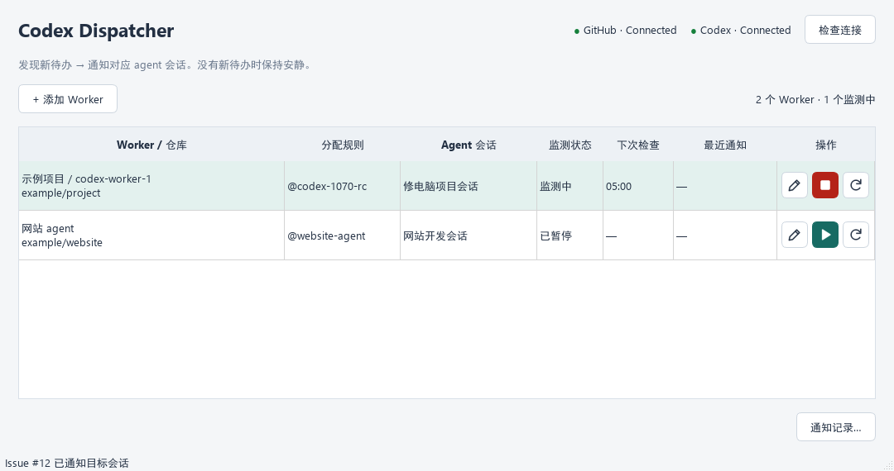

# Codex Dispatcher

Windows 桌面通知器：多个 Worker 监测 GitHub 待办，通知对应的 Codex agent 会话自行读取、执行和收尾。



## 使用

1. 解压 Windows 包，运行整个目录中的 `CodexDispatcher.exe`。
2. GitHub CLI 通过 `gh auth login` 登录；Codex Desktop / CLI 已登录。
3. 添加 Worker：填写名称，**从列表选择 GitHub 仓库**，选择已有 agent 会话。
4. 分配规则默认 **@ 提及**，填写 `codex-1070-rc` 或 `@codex-1070-rc`。
5. 在该 Worker 行点击 **▶ 开始监测**。同一个图标切换为 **■ 停止监测**；每个 Worker 独立控制。
6. **立即检查**可以手工立即查询新待办，即使尚未开启持续监测也会通知匹配的 agent。
7. 每行显示下次检查倒计时；查询时显示“检查中”，停止后显示“—”。手工检查不重置定时计划。

每个 Worker 行都有编辑、开始 / 停止监测、立即检查三个图标按钮，悬停显示说明。编辑时从已登录账号可访问的仓库中选择，支持个人、协作和组织仓库，列表可刷新。已有 Worker 保留原分配规则，新 Worker 默认 @ 提及。会话目录和名称自动读取，连接成功显示绿灯。

关闭窗口可驻留托盘。停止监测只停止后续定时通知，已通知的 agent 继续执行。

## 三种分配规则

| 规则 | 分配值示例 | 匹配来源 |
|---|---|---|
| **@ 提及（默认）** | `codex-1070-rc` | 打开的 Issue 标题、正文及评论中的 `@codex-1070-rc` |
| Label | `agent:repair` | Issue 标签 |
| Assignee | `imherro` | Issue 分配的真实 GitHub 用户 |

虚拟 @ 名称不必对应 GitHub 账号。例如评论：

> @codex-1070-rc 汇报你的ip地址

Dispatcher 只做文本匹配，给绑定会话发送该评论的链接，让 agent 自己读取和处理。不会把“汇报 IP 地址”转述成指令。完整名称匹配、不区分大小写；不会把更长名称、邮箱或路径中的文本当作点名。

@ 规则每个 Worker 对同一 Issue 的标题 / 正文通知一次，对每条评论各通知一次。**同一 Issue 上的新评论再次点名可以再次触发**，重复轮询、重启以及编辑已通知的原评论都不会自动重发。首次开启会检查已有打开 Issue 中尚未通知的提及。匹配不解析 Markdown，因此引用或代码块中的完整点名也会匹配。

Label / Assignee 每个 Worker 对同一仓库 / Issue 自动通知一次，Issue 更新不会自动重发。所有规则在发送前重新检查状态和分配；默认跳过 `agent:running`、`agent:done`、`agent:blocked`。

## 通知与数据

@ 规则读取文字用于确定是否匹配；Label / Assignee 只查元数据。SQLite 和通知只保存地址、编号等元数据，不保存或转述标题、正文、评论内容。评论通知带 `#issuecomment-ID`，agent 可以定位原文。

Dispatcher 没有任务整理模型，也没有额外模型判断调用。空轮询、重复匹配不发消息，不连接 Codex 或读取目标项目。**agent 收到通知后的执行仍正常使用它自己的模型额度**。

收到接收回执即记录“已通知”，不代表 Issue 已完成。桌面桥接的回执可能只有会话 ID，程序不会伪造 Turn ID。agent 遵循原会话项目规范、模型和权限，自行执行、验证、收尾。SDK 模式保持连接直到 agent 回合结束；桌面桥接由原桌面应用持有会话，退出 Dispatcher 不会终止 agent。共享会话的通知串行排队。

## 编辑通知格式

每个 Worker 的编辑窗口可以修改通知格式，实时预览，并恢复默认格式。

| 变量 | 含义 |
|---|---|
| `{issue_url}`（必填） | Issue 或触发评论的原文链接 |
| `{notification_id}`（必填） | 本次通知的唯一 ID，供确认发送结果 |
| `{repository}` | owner/repository |
| `{issue_number}` | Issue 编号 |
| `{source}` | 该 Issue / 该条评论及所属 Issue |

例如：`[{notification_id}] 请读取 {issue_url}，按本项目规范处理，完成后验证并关闭 Issue。`

普通花括号写为 `{{` 和 `}}`。不提供正文、标题和评论内容变量，不执行模板代码。已排队通知保留发现时的格式，修改影响后续新通知。

数据保存在 `%APPDATA%\CodexDispatcher`，包括 SQLite 配置、去重记录和滚动日志。旧版配置与历史可原地升级，保留原规则及去重记录；v0.1 的模型和旧 prompt_template 设置不再生效，新 notification_template 缺省使用默认通知。数据库仍为版本 2。

## 会话占用

默认优先使用已登记的 **Codex 桌面桥接**：通过本机已安装 Codex App Tools 插件使用的管道向原桌面应用发送通知，不另起服务恢复目标会话。空闲但仍由 Desktop 持有的会话可以接收；正在工作的会话将通知保留在 SQLite 队列，空闲后自动发送，忙碌不会因为重试六次而丢弃。忙碌重查会退避，最长约 160 秒。

桥接由 Codex 桌面任务环境提供 `CODEX_APP_TOOLS_PIPE_PATH` 和 `CODEX_THREAD_ID` 后登记，保存的 desktop-bridge.json 仅含真实调用来源会话 ID。此机器已登记，可直接运行新版。桥接在桌面应用重启后重新发现本机管道，不保存令牌。只调用读取会话状态、发送通知两个工具，目标会话必须由用户配置。

**兼容性限制：桥接是已安装桌面插件的本机接口，不是公开稳定的独立 SDK API。** Codex 更新可能改变管道或响应格式；遇到未知发送结果不自动重发。当前集成针对 Windows 验证，不支持多实例歧义选择。原 Codex 桌面应用需要保持运行。

未登记桥接时使用官方 SDK 模式。该模式不能向另一个进程持有写入权的会话派送，空闲并不代表释放写入权；占用时有限重试。保存配置仍只读验证。不要把 SDK 模式的会话占用误认为 agent 正在执行。

发送结果不确定时不自动重发，在“通知记录”中检查和确认。已通知的会话或后台操作运行期间，程序等待结束再退出。升级前先退出旧版。

## 开发与验证

Python 3.12、PySide6、官方 `openai-codex==0.160.0`。

```powershell
python -m venv .venv
.venv\Scripts\python.exe -m pip install -e ".[dev]"
.venv\Scripts\python.exe -m codex_dispatcher.main
.venv\Scripts\python.exe -m pytest -q
powershell -ExecutionPolicy Bypass -File scripts/build.ps1
```

构建输出为 `dist/v0.4.0/CodexDispatcher` 及同目录下的 Windows x64 ZIP。分发整个应用目录，SDK runtime 已包含。

默认测试使用 mock，不消耗真实模型额度，覆盖三种规则、评论去重、旧版迁移、图标按钮、格式验证与预览、桌面回执、持续忙碌排队及不确定发送恢复。

```powershell
.venv\Scripts\python.exe scripts/live_mentions.py --run-live
```

显式真实验收脚本在已有测试 Issue #1 创建两条临时点名评论，向新的独立只读会话发送链接，验证 agent 自己读取评论、同一 Issue 的新评论可再次通知和重复轮询静默；随后删除其创建的测试评论。结果见 [@ 规则验收报告](docs/mention-acceptance-result.json)。

实现使用官方 [GitHub 评论 API](https://docs.github.com/en/rest/issues/comments) 和 [已登录用户仓库 API](https://docs.github.com/en/rest/repos/repos#list-repositories-for-the-authenticated-user)。@ 模式每轮扫描打开的 Issue 和分页评论；大仓库查询可能较慢，打开 Issue 达到 1000 条时明确报错，不静默漏掉候选。

桌面桥接真实验收：`scripts/live_desktop_bridge.py --run-live` 使用新的隔离只读会话和两条临时测试评论。本次空闲 Desktop 会话派送、忙时排队、空闲自动发送、上下文继承已验证；隔离会话读取 GitHub 时被网络代理拒绝，因此完整端到端验收仍标为失败，两条测试评论已删除。报告见 [桌面桥接验收](docs/desktop-bridge-acceptance-result.json)。官方 [App Server 文档](https://learn.chatgpt.com/docs/app-server)区分读取、恢复和会话订阅；本地插件桥接实现依据本机 codex-app-tools 0.1.5 的实际协议。

开发同步约定见 [AGENTS.md](AGENTS.md)：每轮修改前拉取远端，完成验证后自动提交、推送。旧版文档留在 docs 作为历史记录，当前行为以本文为准。
